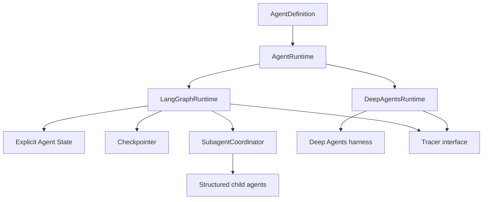
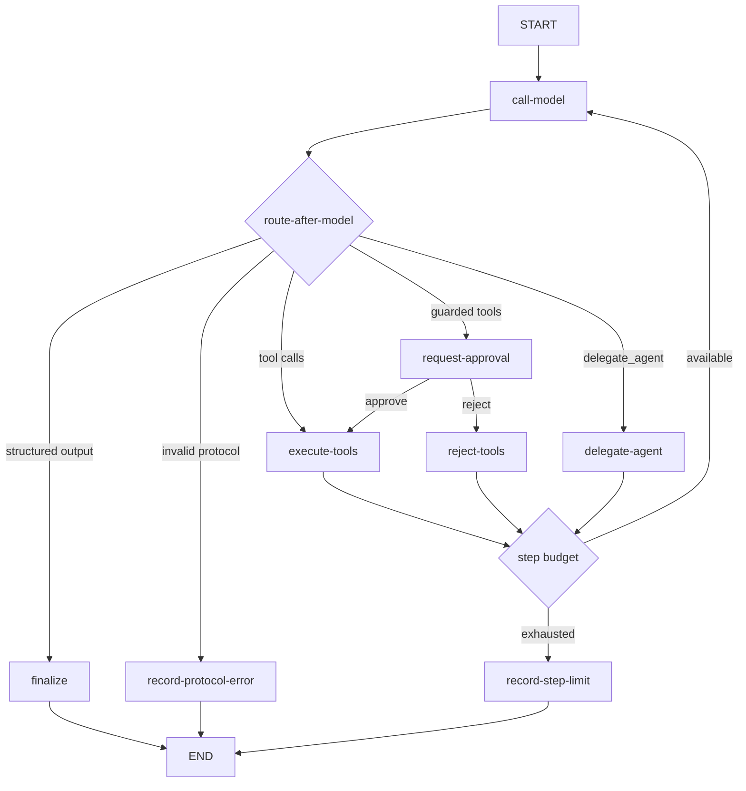
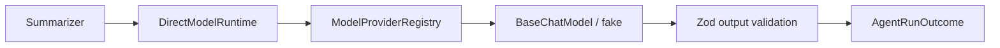
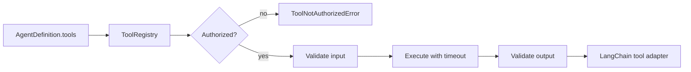

# boio-agents-lab

Laboratorio didáctico en TypeScript para construir y comparar miniagentes explícitos, observables, persistentes y evaluables. **MiniAgents** es el nombre conceptual de la biblioteca; `boio-agents-lab` es el repositorio y el paquete privado durante su desarrollo.

> Estado: **slice 10 — API HTTP**. Run, resume y consultas de runs/sesiones están disponibles mediante un adapter Fastify validado y deny-by-default. El almacenamiento durable continúa diferido hasta tener requisitos concretos.

## Objetivo

El repositorio permitirá estudiar dos formas de construir el mismo tipo de sistema:

- `LangGraphRuntime`: grafo explícito para ver estado, nodos, edges, routing, checkpoints, interrupciones y delegación.
- `DeepAgentsRuntime`: adaptación de mayor nivel para comparar qué resuelve el harness `deepagents` y qué control conserva la aplicación.

La API común se apoya en definiciones serializables. Los agentes declaran modelos, tools y límites; los runtimes deciden cómo ejecutarlos.



## Inicio rápido

Requisitos:

- Node.js 22 o superior (la versión de trabajo está en `.nvmrc`).
- npm 10 o superior.

```bash
npm install
cp .env.example .env
npm run typecheck
npm test
```

En PowerShell, el segundo comando puede reemplazarse por:

```powershell
Copy-Item .env.example .env
```

No hace falta configurar API keys para los tests. Los tests y evals locales deben usar modelos falsos por defecto.

El primer ejemplo funcional tampoco usa red:

```bash
npm run example:summarizer
```

```ts
const result = await summarizer.run({
  input: "Text to summarize",
  sessionId: "example-session",
});

if (result.status === "completed") {
  // result.output: { summary: string; keyPoints: string[] }
}
```

El Researcher demuestra la decisión model-driven de buscar o terminar:

```bash
npm run example:researcher
```

La misma definición ejecutada por el grafo explícito:

```bash
npm run example:langgraph
```

La pausa y reanudación de una tool protegida, también sin red:

```bash
npm run example:hitl
```

La delegación padre → child con contexto aislado:

```bash
npm run example:subagents
```

El dataset y gate de evaluación offline:

```bash
npm run example:evaluation
```

La misma definición mediante el harness Deep Agents, también sin red:

```bash
npm run example:deep-agents
```

## Comandos

| Comando                       | Propósito                                                     |
| ----------------------------- | ------------------------------------------------------------- |
| `npm run dev`                 | Ejecutar el entry point en modo watch.                        |
| `npm run build`               | Compilar `src/` a `dist/`.                                    |
| `npm run typecheck`           | Validar TypeScript estricto sin emitir archivos.              |
| `npm run lint`                | Ejecutar ESLint con reglas tipadas.                           |
| `npm run format:check`        | Comprobar formato Prettier.                                   |
| `npm test`                    | Ejecutar tests unitarios y de integración sin evals.          |
| `npm run test:coverage`       | Ejecutar tests con umbral inicial de 80 %.                    |
| `npm run eval`                | Ejecutar evaluadores funcionales.                             |
| `npm run eval:regression`     | Ejecutar el gate de regresión con salida no cero ante fallos. |
| `npm run example:hitl`        | Interrumpir, aprobar y reanudar una tool protegida sin red.   |
| `npm run example:deep-agents` | Ejecutar Researcher mediante el harness Deep Agents offline.  |
| `npm run example:evaluation`  | Ejecutar dataset, evaluadores y gate offline.                 |
| `npm run example:langgraph`   | Ejecutar el StateGraph explícito sin red.                     |
| `npm run example:researcher`  | Ejecutar Researcher + mock search sin red.                    |
| `npm run example:subagents`   | Ejecutar supervisor + child run estructurado sin red.         |
| `npm run example:summarizer`  | Ejecutar el Summarizer determinista sin API keys.             |

## Estructura objetivo

```text
src/
  core/             contratos y tipos independientes de infraestructura
  graph/            StateGraph, nodos, edges y routers explícitos
  runtime/          LangGraphRuntime y DeepAgentsRuntime
  models/           providers y registry
  tools/            contratos, autorización y built-ins sandboxed
  agents/           definiciones de agentes especializados
  subagents/        delegación, resultados y límites de profundidad
  persistence/      checkpoints, sesiones y adapters durables futuros
  memory/           memoria de corto y largo plazo
  observability/    Tracer y adaptadores Console/Noop/Langfuse
  evals/            datasets, evaluadores y regresiones
  api/              transporte HTTP mínimo
  config/           validación del entorno y composition root
examples/           ejemplos pequeños ejecutables
tests/              tests, evals y regresiones sin red
docs/               material de estudio y decisiones arquitectónicas
```

Las carpetas se crean cuando contienen una implementación real; la estructura completa no se rellena con archivos vacíos.

## Flujo implementado del runtime explícito



Los routers son puros; los efectos ocurren en nodos nombrados. `runId` identifica una ejecución concreta. `sessionId` se mapea a `thread_id`, conserva el checkpoint en `MemorySaver` y permite reanudar el mismo run con una decisión humana validada.

Las tools declaradas en `approvalRequiredTools` se detienen antes del efecto. El resultado de `run()` y `resume()` usa `status: "completed" | "interrupted"`; el caller puede presentar el payload de aprobación y luego continuar con la misma sesión. `MemorySaver` es intencionalmente local y efímero: no sobrevive reinicios ni sustituye un backend de producción.

Los nombres en `AgentDefinition.subagents` forman otra allowlist deny-by-default. `SubagentCoordinator` inicia un run aislado con sus propias tools, conserva `parentRunId`/`childRunId` y aplica un techo de profundidad que no se reinicia en delegaciones anidadas. El resultado del child vuelve al padre como `ChildRunRecord`, sin copiar todo su historial.

## Observabilidad

`Tracer` mantiene el dominio independiente del backend. `NoopTracer` es el default, `ConsoleTracer` facilita estudio local y `LangfuseTracer` usa observaciones v5 sobre OpenTelemetry. Agentes, generaciones explícitas, tools y delegaciones quedan correlacionados; `runId` y `sessionId` no se confunden.

El composition root crea el lifecycle con `createObservability(environment)`, llama `start()` antes de ejecutar agentes y `shutdown()` al cerrar. `LANGFUSE_ENABLED=false`, `LANGFUSE_CAPTURE_INPUT=false` y `LANGFUSE_CAPTURE_OUTPUT=false` son los defaults seguros. La guía completa está en [`docs/10-observability.md`](docs/10-observability.md).

## API HTTP

`createHttpApi()` expone únicamente los agentes añadidos a `HttpAgentRegistry`:

```text
POST /agents/:agentName/run
POST /agents/:agentName/resume
GET  /runs/:runId
GET  /sessions/:sessionId
```

La API valida bodies y parámetros con Zod. Responde `200` al completar y `202` cuando un run queda interrumpido. `InMemoryApiRunStore` habilita lookups locales sin confundir este índice con los checkpoints del runtime; producción puede inyectar otro `ApiRunStore`. Consulta [API HTTP](docs/14-http-api.md) para el contrato, códigos de error y límites actuales.

## Evaluaciones

`runEvaluation()` conecta un dataset versionado, un agente y una lista de evaluadores. Distingue fallos de calidad de errores operativos, agrega latencia/tokens/costo cuando están disponibles y traza cada criterio como `evaluator`. `assertRegressionThresholds()` convierte una caída respecto del baseline en un error tipado y un exit code no cero. La explicación completa está en [`docs/11-evaluations.md`](docs/11-evaluations.md).

### Slice ejecutable actual



`DirectModelRuntime` hace exactamente una llamada y establece el contrato común. No contiene un loop manual ni se describe como LangGraph. Su función es permitir estudiar y probar el límite modelo/structured-output antes de introducir estado y edges.

`ToolCallingRuntime` usa el harness `createAgent`; `LangGraphRuntime` construye el flujo equivalente con `StateGraph`, `StateSchema`, reducers, nodos y edges visibles. `DeepAgentsRuntime` adapta `createDeepAgent`, bloquea sus capacidades implícitas y normaliza el resultado al mismo contrato. El dataset Researcher verifica la comparación sin red.

## Tools y autorización



Las tools usan `lower_snake_case`, se registran explícitamente y nunca se entregan todas a un agente. Los built-ins disponibles son:

- `mock_search`: corpus local determinista.
- `calculator`: operaciones aritméticas sin `eval`.
- `current_time`: reloj y timezone explícitos, con clock inyectable.
- `read_file` y `write_file`: UTF-8 confinado a un sandbox root, con límites de tamaño y overwrite opt-in.

Consulta [Tools](docs/04-tools.md) para los límites de seguridad y ejercicios.

## Configuración y secretos

`.env.example` documenta todas las variables sin contener credenciales. El entorno se valida una sola vez mediante Zod en `src/config/environment.ts`. Una integración se habilita de forma explícita; por ejemplo, Langfuse permanece desactivado si `LANGFUSE_ENABLED=false`.

OpenRouter compartirá el adaptador compatible con OpenAI usando una URL base diferente; OpenAI, Gemini, Groq y Ollama tendrán adapters propios detrás del mismo registry. Ninguna definición de agente construirá directamente un cliente de proveedor.

## Documentación de estudio

Empieza por:

1. [Arquitectura](docs/01-architecture.md)
2. [Estado del agente](docs/03-agent-state.md)
3. [Deep Agents](docs/09-deep-agents.md)
4. [Subagentes](docs/08-subagents.md)
5. [Consideraciones de producción](docs/13-production-considerations.md)
6. [Hoja de ruta](docs/roadmap.md)
7. [Decisiones arquitectónicas](docs/adr/README.md)
8. [Especificación inicial](docs/specification/initial-requirements.md)
9. [API HTTP](docs/14-http-api.md)

Cada documento distingue el diseño acordado de la implementación ya disponible. A medida que se implemente cada slice vertical, su documento explicará el problema, funcionamiento, archivos, decisiones, trade-offs y ejercicios.

## Flujo Git

La rama principal será `main`. Se usarán ramas `feat/...`, `fix/...`, `docs/...`, `refactor/...`, `test/...` y `chore/...`, junto con Conventional Commits. La configuración completa está en [AGENTS.md](AGENTS.md) y [CONTRIBUTING.md](CONTRIBUTING.md).

El repositorio remoto es privado durante la construcción: `sarreche/boio-agents-lab`. Se abrirá únicamente cuando el proyecto esté completo y después de una revisión explícita.
