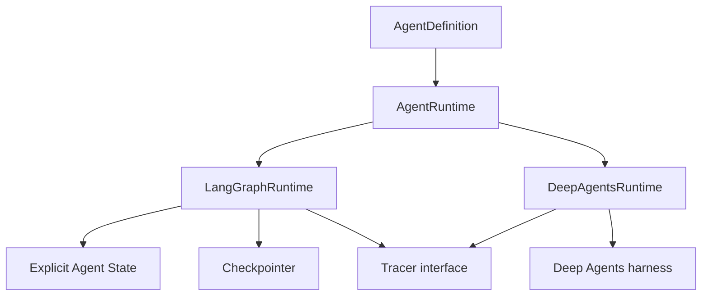
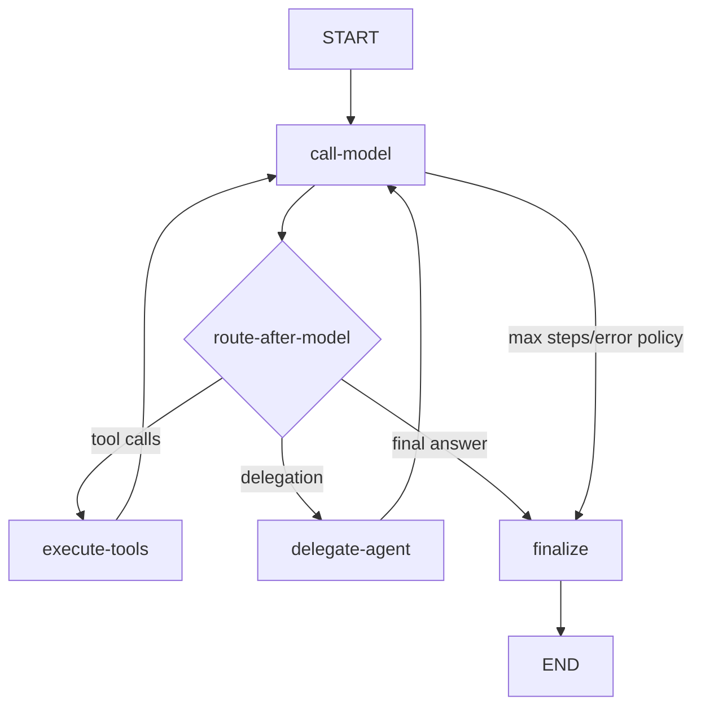

# boio-agents-lab

Laboratorio didáctico en TypeScript para construir y comparar miniagentes explícitos, observables, persistentes y evaluables. **MiniAgents** es el nombre conceptual de la biblioteca; `boio-agents-lab` es el repositorio y el paquete privado durante su desarrollo.

> Estado: **fundación del proyecto**. La configuración, contratos iniciales, calidad, CI y documentación arquitectónica están activos. Los runtimes y agentes descritos en la hoja de ruta todavía no están implementados; no se presentan aquí como funcionales.

## Objetivo

El repositorio permitirá estudiar dos formas de construir el mismo tipo de sistema:

- `LangGraphRuntime`: grafo explícito para ver estado, nodos, edges, routing, checkpoints, interrupciones y delegación.
- `DeepAgentsRuntime`: adaptación de mayor nivel para comparar qué resuelve el harness `deepagents` y qué control conserva la aplicación.

La API común se apoya en definiciones serializables. Los agentes declaran modelos, tools y límites; los runtimes deciden cómo ejecutarlos.



## Inicio rápido

Requisitos:

- Node.js 22 o superior (la versión de trabajo está en `.nvmrc`).
- npm 10 o superior.
- Docker, solo para los ejemplos futuros de persistencia PostgreSQL.

```bash
npm install
cp .env.example .env
npm run typecheck
npm test
```

En PowerShell, el segundo comando puede reemplazarse por:

```powershell
Copy-Item .env.example .env
```

No hace falta configurar API keys para los tests. Los tests y evals locales deben usar modelos falsos por defecto.

## Comandos

| Comando                   | Propósito                                                     |
| ------------------------- | ------------------------------------------------------------- |
| `npm run dev`             | Ejecutar el entry point en modo watch.                        |
| `npm run build`           | Compilar `src/` a `dist/`.                                    |
| `npm run typecheck`       | Validar TypeScript estricto sin emitir archivos.              |
| `npm run lint`            | Ejecutar ESLint con reglas tipadas.                           |
| `npm run format:check`    | Comprobar formato Prettier.                                   |
| `npm test`                | Ejecutar tests unitarios y de integración sin evals.          |
| `npm run test:coverage`   | Ejecutar tests con umbral inicial de 80 %.                    |
| `npm run eval`            | Ejecutar evaluadores funcionales.                             |
| `npm run eval:regression` | Ejecutar el gate de regresión con salida no cero ante fallos. |

PostgreSQL local:

```bash
docker compose up -d postgres
docker compose ps
```

El volumen es persistente. `docker compose down` detiene el servicio sin borrar datos; no uses `down -v` salvo que quieras eliminar el volumen deliberadamente.

## Estructura objetivo

```text
src/
  core/             contratos y tipos independientes de infraestructura
  graph/            StateGraph, nodos, edges y routers explícitos
  runtime/          LangGraphRuntime y DeepAgentsRuntime
  models/           providers y registry
  tools/            contratos, autorización y built-ins sandboxed
  agents/           definiciones de agentes especializados
  subagents/        delegación, resultados y límites de profundidad
  persistence/      checkpoints, sesiones y PostgreSQL
  memory/           memoria de corto y largo plazo
  observability/    Tracer y adaptadores Console/Noop/Langfuse
  evals/            datasets, evaluadores y regresiones
  api/              transporte HTTP mínimo
  config/           validación del entorno y composition root
examples/           ejemplos pequeños ejecutables
tests/              tests, evals y regresiones sin red
docs/               material de estudio y decisiones arquitectónicas
```

Las carpetas se crean cuando contienen una implementación real; la estructura completa no se rellena con archivos vacíos.

## Flujo previsto del runtime explícito



Los routers serán puros; los efectos ocurrirán en nodos nombrados. `sessionId` seleccionará continuidad/checkpoints y `runId` identificará una ejecución concreta.

## Configuración y secretos

`.env.example` documenta todas las variables sin contener credenciales. El entorno se valida una sola vez mediante Zod en `src/config/environment.ts`. Una integración se habilita de forma explícita; por ejemplo, Langfuse permanece desactivado si `LANGFUSE_ENABLED=false`.

OpenRouter compartirá el adaptador compatible con OpenAI usando una URL base diferente; OpenAI, Gemini, Groq y Ollama tendrán adapters propios detrás del mismo registry. Ninguna definición de agente construirá directamente un cliente de proveedor.

## Documentación de estudio

Empieza por:

1. [Arquitectura](docs/01-architecture.md)
2. [Estado del agente](docs/03-agent-state.md)
3. [Deep Agents](docs/09-deep-agents.md)
4. [Consideraciones de producción](docs/13-production-considerations.md)
5. [Hoja de ruta](docs/roadmap.md)
6. [Decisiones arquitectónicas](docs/adr/README.md)
7. [Especificación inicial](docs/specification/initial-requirements.md)

Cada documento distingue el diseño acordado de la implementación ya disponible. A medida que se implemente cada slice vertical, su documento explicará el problema, funcionamiento, archivos, decisiones, trade-offs y ejercicios.

## Flujo Git

La rama principal será `main`. Se usarán ramas `feat/...`, `fix/...`, `docs/...`, `refactor/...`, `test/...` y `chore/...`, junto con Conventional Commits. La configuración completa está en [AGENTS.md](AGENTS.md) y [CONTRIBUTING.md](CONTRIBUTING.md).

Todavía no hay remoto ni repositorio GitHub creado. Ese paso se hará explícitamente con la cuenta habitual de `sarreche` cuando corresponda.
