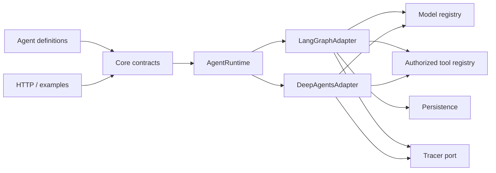

# 01 — Arquitectura

## Problema

Un framework de agentes suele volverse difícil de estudiar por dos motivos opuestos: demasiadas decisiones quedan ocultas por el framework o la aplicación vuelve a implementar primitivas que LangGraph ya resuelve. MiniAgents separa contratos propios, orquestación explícita y adaptadores externos para conservar visibilidad sin duplicar el runtime.

## Diseño

`AgentDefinition` es dato serializable. Describe identidad, prompt versionado, modelo, tools permitidas y límites. `AgentRuntime` será el puerto que ejecute esa definición. Los dos adapters planeados son deliberadamente diferentes internamente:

- LangGraph construye un `StateGraph` visible, con estado y routing propios.
- Deep Agents configura el harness y documenta las capacidades delegadas.

Las dependencias concretas se ensamblan en un composition root, no dentro de agentes ni contratos. Esto permite sustituir un provider, un tracer o un checkpointer en tests.

## Decisiones

- ESM y NodeNext para seguir el ecosistema actual de LangChain.
- Zod en todos los límites dinámicos: entorno, tools, structured output y datos persistidos.
- Identificadores separados para sesiones y runs.
- Tools deny-by-default y filesystem confinado a un root validado.
- Persistencia de checkpoints separada del almacenamiento de memoria de largo plazo.
- Trazas mediante una interfaz propia; Langfuse es un adapter opcional.

## Trade-offs

Los puertos propios agregan algo de código, pero aíslan infraestructura y facilitan fakes. No se crea una interfaz local para cada tipo externo: LangGraph permanece visible dentro de `src/graph`, donde esconderlo reduciría el valor pedagógico.

## Dónde mirar

Hoy: `src/core/agent-definition.ts`, `src/config/environment.ts`, `AGENTS.md` y las ADR. En el siguiente slice: `src/core/agent-runtime.ts`, `src/graph/state.ts` y `src/graph/create-agent-graph.ts`.

## Ejercicios

1. Añadir un campo serializable a `AgentDefinition` y observar qué tests/documentos deben cambiar.
2. Dibujar qué import sería inválido si `src/core` intentara crear un cliente OpenAI.
3. Explicar por qué un registry global complica tests paralelos.
