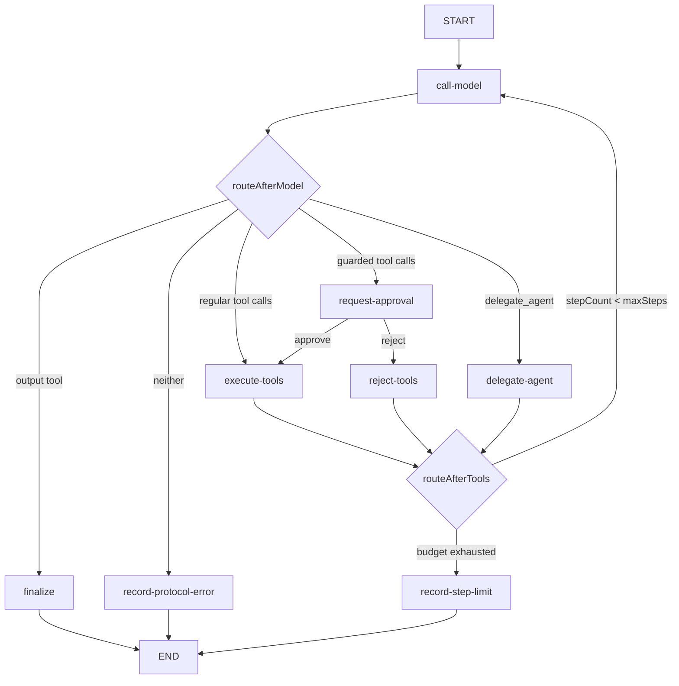

# 02 — Runtime LangGraph

## Problema

Un agent harness resuelve el loop, pero oculta decisiones que conviene estudiar: qué actualiza cada paso, dónde ocurren los efectos, por qué se toma un edge y cuándo termina la ejecución. `LangGraphRuntime` implementa el mismo puerto que los runtimes anteriores y expone esas decisiones con Graph API.

## Flujo implementado

`call-model` vincula solamente las tools autorizadas y una tool terminal derivada del nombre del agente, por ejemplo `researcher_output`. Su `retryPolicy` reintenta fallos del provider hasta el máximo configurado; un intento fallido no incrementa `stepCount` porque no produjo una transición útil. Cada model call tiene deadline propio y recibe una señal de cancelación.

`execute-tools` procesa las llamadas secuencialmente para conservar un orden visible de efectos. Usa `ToolRegistry`, por lo que autorización, Zod y timeout siguen aplicándose. Un error de tool se serializa y vuelve como `ToolMessage`: el modelo puede corregir argumentos o elegir otro camino.

Si una llamada pertenece a `approvalRequiredTools`, `request-approval` interrumpe el thread antes del efecto. Al aprobar se continúa hacia `execute-tools`; al rechazar, `reject-tools` crea respuestas de protocolo y auditoría sin invocar las tools. Un solo dictamen cubre el batch completo del mensaje para evitar ejecuciones parciales ambiguas.

Si el modelo llama la tool sintética `delegate_agent`, el router exige que sea la única llamada del mensaje y dirige a `delegate-agent`. Ese nodo ejecuta un child mediante el coordinator y agrega su hand-off a `childRuns`; luego el supervisor vuelve a `call-model`. La ejecución del hijo no se mezcla con `execute-tools` porque posee otra definición y otra allowlist.

`finalize` exige que la tool terminal sea la única llamada del mensaje y valida otra vez sus argumentos con el output schema. Los nodos de error convierten fallos de protocolo y agotamiento de presupuesto en un final determinista. El adapter traduce un estado fallido a `AgentExecutionError`.

## Límites y retries

`maxSteps` cuenta model calls exitosas. Después de ejecutar tools, `routeAfterTools` impide regresar al modelo si el presupuesto ya se consumió. LangGraph también recibe un `recursionLimit` defensivo, pero no se usa como regla de negocio.

El retry pertenece a `call-model`, el nodo que conoce el efecto remoto. Se mantiene acotado y no envuelve tools: estas ya tienen timeout y sus errores son recuperables por el propio loop. El runtime añade un deadline global para impedir que retries, routing o una dependencia no cooperativa retengan al caller indefinidamente. La clasificación fina de errores transitorios queda en adapters concretos de provider; el laboratorio no inventa códigos universales.

## Decisiones y trade-offs

- Graph API y `StateSchema` actual, no Functional API ni `Annotation.Root` legado.
- Nodos pequeños que retornan partial updates; no mutan state.
- Routers exportados, síncronos y sin efectos para poder probarlos aisladamente.
- Structured output como tool terminal: añade una convención, pero hace visible la decisión de terminar.
- `LangGraphRuntime` compila con un `MemorySaver` por defecto y acepta otro `BaseCheckpointSaver` inyectado. `sessionId` es el `thread_id`; los otros runtimes no ofrecen resume.
- `ToolCallingRuntime` permanece como referencia de alto nivel; no se elimina al agregar la variante explícita.

## Dónde leer

1. `src/graph/state.ts`
2. `src/graph/routers.ts`
3. `src/graph/nodes/call-model.ts`
4. `src/graph/nodes/execute-tools.ts`
5. `src/graph/nodes/finalize.ts`
6. `src/graph/nodes/record-errors.ts`
7. `src/graph/nodes/request-approval.ts` y `reject-tools.ts`
8. `src/graph/create-agent-graph.ts`
9. `src/graph/nodes/delegate-agent.ts` y `src/subagents/`
10. `src/runtime/langgraph-runtime.ts`
11. `tests/graph/` y `tests/runtime/`
12. `examples/explicit-langgraph.ts`, `human-in-the-loop.ts` y `subagent-coordinator.ts`

## Ejercicios

1. Agregar logging temporal a cada nodo y reconstruir la secuencia del ejemplo.
2. Hacer que el fake devuelva una tool inexistente y observar el error recuperable en state.
3. Reducir `maxSteps` y explicar por qué el guard ocurre después de `execute-tools`.
4. Devolver output terminal junto con otra tool y localizar dónde se rechaza.
5. Dibujar el mismo flujo oculto dentro de `ToolCallingRuntime` y comparar superficies.

## Referencias verificadas

- [LangGraph Graph API](https://docs.langchain.com/oss/javascript/langgraph/use-graph-api)
- [LangGraph Graph API overview](https://docs.langchain.com/oss/javascript/langgraph/graph-api)
- [LangGraph quickstart](https://docs.langchain.com/oss/javascript/langgraph/quickstart)
- [Thinking in LangGraph](https://docs.langchain.com/oss/javascript/langgraph/thinking-in-langgraph)
- [LangGraph persistence](https://docs.langchain.com/oss/javascript/langgraph/persistence)
- [LangGraph interrupts](https://docs.langchain.com/oss/javascript/langgraph/interrupts)
