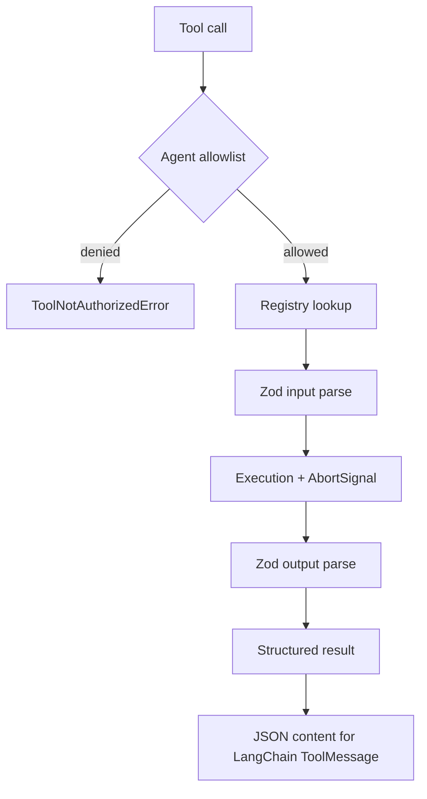

# 04 — Tools

## Problema

Una tool convierte argumentos producidos por un modelo —por definición no confiables— en un efecto del sistema. Debe validar datos, aplicar autorización antes del efecto, limitar recursos y devolver un resultado interpretable sin acoplar el dominio a LangChain.

## Flujo implementado

`defineTool()` conserva los tipos concretos dentro de la implementación y expone un `RegisteredTool` heterogéneo al registry. Cada definición incluye nombre, descripción, input schema, output schema y executor. Los nombres deben usar `lower_snake_case` para compatibilidad entre providers.

`ToolRegistry.execute()` recibe explícitamente la allowlist del agente. Comprueba autorización antes del lookup para no revelar innecesariamente si una tool denegada existe. La ejecución tiene timeout y recibe `AbortSignal`; una tool cooperativa puede cancelar trabajo interno cuando expira.

`toLangChainTools()` adapta solamente las tools listadas en `AgentDefinition.tools`. El adapter serializa el resultado validado como contenido JSON para el `ToolMessage`. La definición del dominio no depende de `ToolNode` ni del formato de mensajes.

## Built-ins

- `mock_search`: rankea por coincidencia de términos sobre un corpus local inyectado. Es determinista y reemplazable por una búsqueda real posterior.
- `calculator`: add/subtract/multiply/divide sobre números; no usa `eval` ni interpreta código.
- `current_time`: usa timezone IANA y permite inyectar el reloj para tests.
- `read_file`: lee UTF-8 dentro del sandbox, valida path real, tipo y tamaño.
- `write_file`: rechaza paths absolutos/traversal, symlinks como target, contenido grande y overwrite no autorizado.

## Filesystem sandbox

El root se resuelve a path real. Los paths solicitados deben ser relativos y permanecer dentro del root tanto lexicalmente como después de resolver el parent/archivo. Los directorios intermedios existentes no pueden ser symlinks. `overwrite` es `false` por defecto y el límite inicial es 1 MiB.

Esto protege frente a errores y path traversal en un entorno controlado. No elimina completamente carreras TOCTOU frente a otro proceso local hostil que modifique el árbol entre validación y escritura; una producción multitenant requeriría filesystem aislado, handles seguros o un sandbox externo.

## Decisiones y trade-offs

- Autorización en código, no en prompts.
- Input y output validados: las tools también pueden tener bugs.
- Registry inyectable en lugar de singleton global.
- Abort cooperativo: JavaScript no puede detener por fuerza una Promise que ignora la señal.
- `ClientTool` existe solo en el adapter; el contrato principal sigue siendo propio.

## Dónde leer

1. `src/tools/tool.ts`
2. `src/tools/registry.ts`
3. `src/tools/builtins/mock-search.ts`
4. `src/tools/builtins/calculator.ts`
5. `src/tools/builtins/current-time.ts`
6. `src/tools/builtins/sandboxed-files.ts`
7. `src/runtime/tool-calling-runtime.ts`
8. `tests/tools/`

## Ejercicios

1. Registrar una tool pero omitirla de `AgentDefinition.tools` y observar el error.
2. Pasar argumentos malformados y revisar `InvalidToolArgumentsError.issues`.
3. Crear una tool que atienda `AbortSignal` y variar el timeout.
4. Intentar path traversal, overwrite implícito y un archivo sobre el límite.
5. Sustituir `mock_search` por otro corpus sin cambiar Researcher.

## Referencias verificadas

- [LangChain Tools](https://docs.langchain.com/oss/javascript/langchain/tools)
- [LangChain model tool calling](https://docs.langchain.com/oss/javascript/langchain/models)
- [DynamicStructuredTool reference](https://reference.langchain.com/javascript/langchain-core/tools/DynamicStructuredTool)
