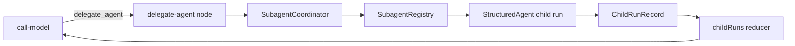

# 08 — Subagentes

## Problema

Delegar puede aislar contexto y especializar capacidades, pero también puede introducir escalada de privilegios, ciclos ilimitados y resultados difíciles de relacionar con el padre. MiniAgents necesita que la decisión siga visible en el grafo y que cada child mantenga su propia definición, tools y run.

## Funcionamiento implementado

El patrón es supervisor/subagents síncrono con una única tool de dispatch:



1. La definición del padre declara nombres en `subagents`; esta lista es deny-by-default.
2. El composition root registra instancias `StructuredAgent` en `SubagentRegistry` y entrega un `SubagentCoordinator` a `LangGraphRuntime`.
3. El modelo recibe la tool sintética `delegate_agent` con argumentos Zod `{ agentName, task }` y descripciones de los hijos autorizados.
4. `routeAfterModel` acepta exactamente una delegación por mensaje. `delegate-agent` valida argumentos y llama al coordinator.
5. El coordinator comprueba autorización, registro y profundidad antes de iniciar el child. El hijo recibe solo la tarea delegada y lineage; no recibe el historial ni las tools del padre.
6. El child crea su propio `runId`. El padre persiste un `ChildRunRecord` con `parentRunId`, `childRunId`, profundidad, status y output/interrupción.
7. El resultado serializado vuelve como `ToolMessage`, permitiendo que el supervisor sintetice o delegue otra tarea en un turno posterior.

## Profundidad y ciclos

La raíz inicia en profundidad `0` y establece `delegationMaxDepth` desde `AgentDefinition.maxSubagentDepth`. Cada child recibe un `AgentRunLineage` con el límite heredado. Antes de delegar nuevamente se aplica el menor techo entre el heredado y la política local del padre actual. Por eso cambiar de agente o formar un ciclo A → B → A no reinicia el presupuesto.

El límite se aplica en `SubagentCoordinator`, no en el prompt. Una violación no inicia el child; el nodo devuelve al modelo un error serializado y recuperable.

## Decisiones y trade-offs

- Se usa el patrón oficial de subagents como tools, pero la ejecución ocurre en un nodo propio para conservar estado y control flow visibles.
- Hay una sola tool de dispatch porque el registry puede crecer sin modificar el grafo. Las descripciones se enumeran en el schema visible al modelo; es apropiado para un catálogo pequeño.
- La ejecución es secuencial y síncrona. Se admite una delegación por mensaje para evitar una política implícita de paralelismo y fallos parciales.
- El child se registra como agente completo y conserva su allowlist. No existe herencia automática de tools, sesiones ni historial.
- Un child interrumpido puede quedar representado en `ChildRunRecord`, pero este slice no reanuda automáticamente árboles anidados. La aplicación deberá coordinar ese workflow antes de considerarlo una experiencia completa.
- `DirectModelRuntime` y `ToolCallingRuntime` rechazan definiciones con subagentes para no ignorar silenciosamente la política.

## Ubicación y recorrido de lectura

1. `src/subagents/registry.ts`
2. `src/subagents/coordinator.ts`
3. `src/graph/nodes/delegate-agent.ts`
4. `src/graph/routers.ts`
5. `src/graph/create-agent-graph.ts`
6. `src/graph/state.ts`
7. `src/runtime/langgraph-runtime.ts`
8. `tests/subagents/coordinator.test.ts`
9. `tests/runtime/langgraph-subagents.test.ts`
10. `examples/subagent-coordinator.ts`

Ejecutar la demostración sin red ni credenciales:

```bash
npm run example:subagents
```

## Ejercicios

1. Crear un ciclo A → B → A y observar en qué profundidad lo detiene el coordinator.
2. Hacer fallar un hijo y observar el `ToolMessage` recuperable que recibe el supervisor.
3. Agregar una tool exclusiva al padre y comprobar que el hijo no puede invocarla.
4. Diseñar una política explícita para dos delegaciones paralelas y sus fallos parciales.

## Referencias verificadas

- [LangChain subagents](https://docs.langchain.com/oss/javascript/langchain/multi-agent/subagents)
- [LangChain multi-agent patterns](https://docs.langchain.com/oss/javascript/langchain/multi-agent)
- [LangGraph subgraphs](https://docs.langchain.com/oss/javascript/langgraph/use-subgraphs)
