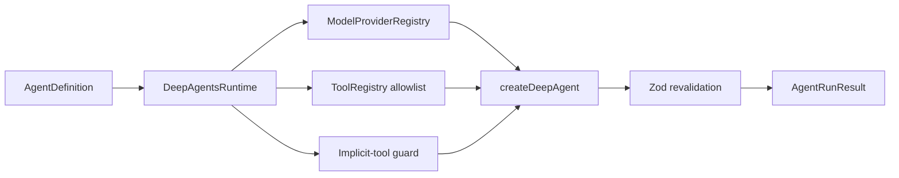

# 09 — Deep Agents

## Problema

Deep Agents ofrece un harness de alto nivel con planificación, context management, filesystem y subagentes. MiniAgents necesita estudiarlo sin confundir esos defaults con las garantías del runtime explícito ni permitir que una capacidad incorporada eluda la allowlist de cada `AgentDefinition`.

## Funcionamiento implementado

`DeepAgentsRuntime` traduce la misma definición declarativa usada por `LangGraphRuntime`: resuelve el modelo mediante `ModelProviderRegistry`, adapta únicamente las tools autorizadas desde `ToolRegistry`, entrega el schema Zod como `responseFormat` y normaliza `structuredResponse`, tool calls, tiempos e identidad al `AgentRunResult` común.

`createDeepAgent()` construye internamente un grafo LangGraph compilado. La aplicación conserva el contrato exterior, pero delega al harness su loop, middleware y estado interno. El backend predeterminado es `StateBackend`, por lo que el contexto de esa invocación es efímero y no constituye persistencia durable.

## Límite de seguridad

Deep Agents incorpora tools como `read_file`, `write_file`, `execute`, `task` y `write_todos`. El runtime base de MiniAgents no las autoriza implícitamente:

1. registra un harness profile que las excluye y desactiva el subagente general-purpose;
2. añade middleware propio que las quita de cada model request;
3. rechaza su ejecución aunque un modelo intente invocarlas;
4. usa permisos deny para lectura y escritura sobre `/**`;
5. nunca configura un backend con shell.

El profile ayuda a configurar el harness, pero no es la frontera principal: algunos modelos envueltos pueden anunciar una identidad de provider distinta de la definición. El middleware aplica la política en código para todas las instancias. Las tools declaradas siguen validando input/output, timeout y autorización mediante `ToolRegistry`.

## Comparación ejecutable

| Aspecto          | `LangGraphRuntime`                    | `DeepAgentsRuntime`                                                      |
| ---------------- | ------------------------------------- | ------------------------------------------------------------------------ |
| Loop             | Nodos, edges y routers propios        | Harness configurado                                                      |
| Estado           | Schema versionado del proyecto        | Estado interno del harness adaptado al final                             |
| Steps            | Contador explícito por transición     | Límite de llamadas por middleware y conteo normalizado                   |
| HITL             | Interrupt/resume y checkpoint propios | No adaptado todavía; se rechaza explícitamente                           |
| Subagentes       | Coordinator y child runs propios      | Defaults desactivados; declaraciones se rechazan hasta preservar lineage |
| Persistencia     | Checkpointer inyectable               | `StateBackend` efímero en este adapter                                   |
| Valor de estudio | Máxima visibilidad y control          | Menos código de orquestación, más comportamiento delegado                |

`tests/evals/runtime-comparison.test.ts` ejecuta las dos variantes del Researcher sobre `researchDataset`. Ambas deben satisfacer exactamente las mismas políticas de tools y presupuesto. Esto compara el contrato observable; no afirma que los grafos internos sean equivalentes.

## Decisiones y trade-offs

El adapter no habilita todavía planificación, filesystem ni subagentes propios del harness. Activarlos por defecto rompería el principio deny-by-default y haría que dos runtimes con la misma definición tuvieran permisos distintos. Tampoco simula HITL o child runs: mientras no exista una traducción que conserve sesiones, approvals, lineage y tracing, esas definiciones fallan temprano con errores tipados.

La salida estructurada se valida primero en el harness y otra vez en el límite MiniAgents. La doble validación cuesta poco y evita confiar en la forma devuelta por una dependencia externa. Los límites de model/tool calls complementan el `recursionLimit`; una instrucción de prompt nunca sustituye esos controles.

## Dónde mirar

- `src/runtime/deep-agents-runtime.ts`: adapter, profile, guard, límites y normalización.
- `tests/runtime/deep-agents-runtime.test.ts`: integración real del harness y capacidades rechazadas.
- `tests/evals/runtime-comparison.test.ts`: mismo dataset contra ambos runtimes.
- `examples/deep-agent.ts`: ejemplo offline con modelo falso.
- `docs/adr/0011-safe-deep-agents-adapter.md`: decisión durable y referencias upstream.

## Camino de lectura

1. Leer primero `AgentDefinition` y `AgentRuntime` en `src/core/`.
2. Comparar `src/runtime/langgraph-runtime.ts` con `src/runtime/deep-agents-runtime.ts`.
3. Abrir el test comparativo y seguir un caso con search y otro con respuesta directa.
4. Revisar la ADR para separar garantías del proyecto de defaults del framework.

## Ejercicios

1. Dibujar las transiciones explícitas que el harness oculta para el caso de search.
2. Inyectar un factory falso y comprobar qué datos pertenecen al contrato MiniAgents.
3. Diseñar, sin implementarlo, el mapping necesario para que un subagente preserve `parentRunId`, profundidad y trace.
4. Proponer un backend durable y explicar por qué no debe mezclarse con memoria de largo plazo.
