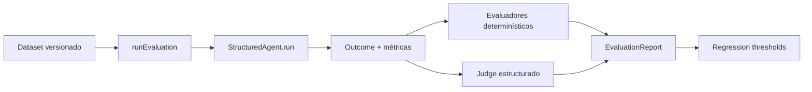

# 11 — Evaluaciones

## Problema

Los tests comprueban invariantes del software; no dicen si un agente eligió las tools correctas, mantuvo calidad o empeoró entre versiones. Las evals ejecutan casos versionados, aplican criterios independientes y producen evidencia agregada que puede bloquear una regresión.

## Flujo implementado

`runEvaluation()` recorre los casos secuencialmente. Esto sacrifica throughput pero conserva orden reproducible, atribución simple de latencia y un flujo fácil de estudiar. Cada caso contiene input, expectativa opcional, comportamiento esperado, tools requeridas/prohibidas y tags. Los IDs son únicos dentro de cada versión.

El reporte separa tres estados:

- `passed`: todos los evaluadores produjeron scores aprobados.
- `failed`: los evaluadores funcionaron y detectaron calidad o comportamiento insuficiente.
- `error`: falló la ejecución o un evaluador no pudo emitir un resultado válido.

Un error del judge nunca se transforma en score cero ni en aprobación. Se registra como fallo de etapa `evaluator`; los scores disponibles permanecen visibles, y el error rate puede bloquear el gate.

## Evaluadores determinísticos

Las factories en `src/evals/deterministic/index.ts` cubren:

| Evaluador       | Pregunta que responde                                |
| --------------- | ---------------------------------------------------- |
| schema validity | ¿El output completado satisface el schema Zod?       |
| required fields | ¿Existen los campos de dominio exigidos?             |
| expected tools  | ¿Se llamaron todas las tools esperadas?              |
| forbidden tools | ¿Se evitó cada tool prohibida?                       |
| max steps       | ¿El run respetó el presupuesto evaluado?             |
| latency         | ¿La medición quedó bajo el máximo?                   |
| cost            | ¿El costo normalizado existe y quedó bajo el máximo? |

Los scores están normalizados entre 0 y 1. Token usage y costo son opcionales porque los runtimes todavía no normalizan todos los providers; `extractMetrics` permite agregarlos sin inventar valores.

## LLM-as-a-Judge

`JudgeModel` es un puerto pequeño que puede implementar otro modelo o un fake. `createLlmJudgeEvaluator()` valida con Zod cuatro dimensiones de 0 a 4 —correctness, completeness, relevance y groundedness— más una justificación. La suma se normaliza sobre 16 y se compara con un threshold configurable.

El puerto recibe solo input, expected behavior, expectativa y output final. La elección del provider y su structured-output adapter pertenece al composition root, no al runner.

## Regression gate

`assertRegressionThresholds()` compara pass rate, average score, error rate, latencia media y scores por evaluador. Ante cualquier violación lanza `RegressionThresholdError`. Como `npm run eval:regression` se ejecuta bajo Vitest, la excepción produce naturalmente un exit code distinto de cero.

El baseline offline `researchDataset` contiene un caso que exige search y otro que lo prohíbe. Usa un fake determinístico en CI; las evaluaciones con providers reales deberán vivir en una suite opt-in separada.

## Ubicación y lectura sugerida

1. `src/evals/dataset.ts`: forma y validación del dataset.
2. `src/evals/evaluator.ts`: contexto, score y métricas.
3. `src/evals/runner.ts`: ejecución, fallos y agregación.
4. `src/evals/deterministic/`: políticas sin modelo.
5. `src/evals/llm-judge.ts`: rúbrica estructurada.
6. `src/evals/regression.ts`: thresholds y error de gate.
7. `tests/evals/`, `tests/regression/` y `examples/evaluation.ts`: uso offline completo.

## Decisiones y trade-offs

El runner no ejecuta casos en paralelo ni reintenta judges: ambas políticas ocultarían costo, orden y clases de fallo. El contrato conserva métricas ausentes como ausentes. El score agregado promedia scores emitidos, mientras `errorCases` evita que un evaluador roto parezca una mejora. Los datasets viven en código TypeScript para recibir tipos y revisión de Git; una fuente remota podrá adaptarse después.

## Ejercicios

1. Hacer que el fake llame una tool prohibida y observar `failed`.
2. Cambiar `minimumEvaluatorScores` por encima del baseline y observar el exit code.
3. Crear dos fakes de judge con rúbricas distintas y medir desacuerdo.
4. Agregar un caso al dataset sin modificar el runner.
