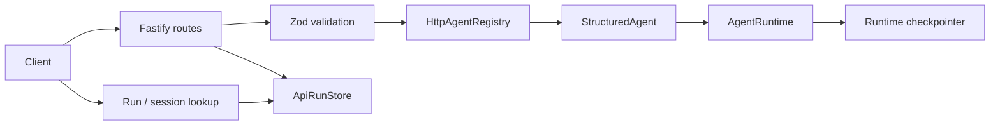

# 14 — API HTTP

## Problema

Los runtimes ya ejecutan y reanudan agentes, pero una aplicación necesita un límite de transporte estable para iniciar runs y consultar su estado sin conocer LangGraph, Deep Agents ni el checkpointer. La API debe conservar la diferencia entre `runId` y `sessionId`, validar todo input dinámico y exponer únicamente agentes autorizados.

## Funcionamiento

`createHttpApi()` construye una instancia Fastify a partir de dos dependencias explícitas:

- `HttpAgentRegistry`, la allowlist de agentes que pueden invocarse por red;
- `ApiRunStore`, el índice consultable de runs y sesiones, con `InMemoryApiRunStore` como implementación local predeterminada.



Rutas:

```text
POST /agents/:agentName/run
POST /agents/:agentName/resume
GET  /runs/:runId
GET  /sessions/:sessionId
```

`run` acepta `input`, `sessionId` opcional y `metadata` opcional. `resume` acepta `sessionId`, un `value` opaco que el runtime valida según su protocolo y `metadata` opcional. Un resultado completo devuelve `200`; una interrupción que espera intervención devuelve `202`. Los errores usan un envelope estable `{ error: { code, message, issues? } }`.

El lookup de run incluye el último outcome completo. El lookup de sesión es deliberadamente compacto: identifica agente, run y estado actual. Reanudar actualiza ambos índices sin cambiar el `runId`.

## Uso

```ts
const agents = new HttpAgentRegistry().register(researcher);
const api = createHttpApi({ agents });

await api.listen({ host: "127.0.0.1", port: environment.PORT });
```

El composition root es responsable de registrar agentes, construir runtimes/providers/tools, iniciar observabilidad y cerrar tanto Fastify como observabilidad. Los tests usan `app.inject()` y no abren sockets ni requieren red.

## Decisiones y trade-offs

- `src/api` depende de contratos de `core`; `core` no importa Fastify.
- El registro HTTP es deny-by-default y separado de registros de modelos, tools y subagentes.
- El body tiene un límite predeterminado de 64 KiB, configurable al crear la API.
- Los fallos inesperados se registran en servidor, pero la respuesta no filtra causas internas.
- `InMemoryApiRunStore` es efímero, local al proceso y no resuelve concurrencia distribuida. Tampoco es el checkpointer: perder el índice de consulta no equivale a perder el estado durable de un runtime futuro.
- La API todavía no autentica al actor de una aprobación. No debe exponerse públicamente sin un gateway de autenticación/autorización; el endurecimiento corresponde al punto 11.

## Ubicación y lectura

Leer `src/api/agent-registry.ts`, `src/api/http-api.ts`, `src/api/run-store.ts` y `tests/api/http-api.test.ts`. La decisión durable está en `docs/adr/0012-thin-http-api-and-query-index.md`.

## Ejercicios

1. Ejecutar un agente sin `sessionId` y consultar el run por `runId`.
2. Interrumpir un agente protegido, consultar la sesión, reanudarlo y comprobar que conserva el run.
3. Implementar `ApiRunStore` sobre una base durable sin modificar rutas ni runtimes.
